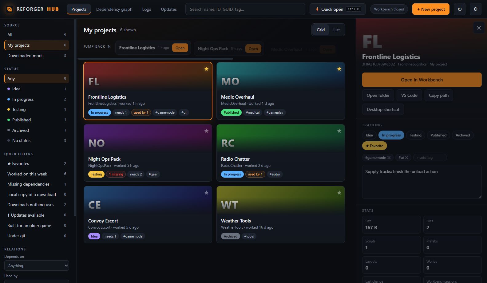

# Reforger Hub

A fast, modern project launcher and mod manager for **Arma Reforger** modders — a replacement for the stock
Arma Reforger Tools launcher, with filters, dependency tracking, project notes and one-click mod updates.



> **Unofficial.** Reforger Hub is a community tool. It is not affiliated with, endorsed by or supported by
> Bohemia Interactive. "Arma" and "Arma Reforger" are trademarks of Bohemia Interactive a.s.

## Features

- **All your addons in one place** — your Workbench projects and every downloaded Workshop mod, as cards or a list.
- **Filters and search** — by source, status, tags, favourites, "worked on this week", missing dependencies,
  downloads nothing uses, projects under git, mods with updates, mods built for an older game version.
- **Dependencies** — what each project needs and what needs it, missing dependencies flagged, and a pan / zoom
  dependency graph of your projects.
- **Project tracking** — status (idea, in progress, testing, published, archived), tags, notes and favourites.
- **Workbench** — open any project in Workbench in one click (or `Ctrl+K` quick open), desktop shortcuts per project,
  "jump back in" to what you worked on last, session history and a readable view of the latest Workbench log errors.
- **Mod updates** — see which downloaded mods have a newer version on the Workshop (with size, changelog and the
  game version they target) and update them without starting the game.

## Install

1. Go to **[Releases](../../releases/latest)** and download one of the zips:
   - **`…-win-x64-standalone.zip`** — works on any 64-bit Windows 10 / 11, nothing else to install (recommended).
   - **`…-win-x64.zip`** — much smaller, needs the [.NET 9 Desktop Runtime](https://dotnet.microsoft.com/download/dotnet/9.0).
2. Unzip it anywhere and run `ReforgerHub.exe`. It also needs the
   [WebView2 runtime](https://developer.microsoft.com/microsoft-edge/webview2/), which up-to-date Windows 10 / 11 already has.
3. Open **Settings** (⚙) and check the folders it found: the Workbench executable, the game folder, your
   Workbench addons folder, the downloaded mods folder and the Workbench logs folder.

## How mod updates work

Workshop mods can only be downloaded by the game or by Bohemia's free **Arma Reforger Dedicated Server**.
Reforger Hub never downloads or hosts mods itself:

1. **Version check** — it reads each mod's public page on `reforger.armaplatform.com` (a few at a time) and compares
   the latest version with the one in the mod's `ServerData.json` on your disk.
2. **One-time setup** — on request it downloads Valve's SteamCMD and installs the free dedicated server
   (Steam app 1874900, anonymous login, a few GB).
3. **Update** — it runs that server hidden, with a private config that lists only the mods to update, and points its
   download folder at your game's mods folder. When every mod reports its new version on disk, the server is stopped.

Close the game and Workbench before updating (they keep the mod files open).

## Build

Requirements: Windows, the [.NET 9 SDK](https://dotnet.microsoft.com/download).

```
dotnet build -c Release
```

The app ends up in `bin/Release/net9.0-windows/`. Release builds are deterministic and contain no debug symbols or
local paths.

Releases are built by GitHub Actions: pushing a tag like `v1.2.0` builds both zips and publishes the release
(see `.github/workflows/release.yml`).

`ReforgerHub.exe --demo shot.png` opens the app on made-up example projects, saves a screenshot of the window and
closes (that is how the picture above is made).

## Data it keeps

Settings and tracking (status, tags, notes) are stored in `%AppData%\ReforgerHub`. The updater's SteamCMD, server
and its config live in `%LocalAppData%\ReforgerHub`. Nothing is sent anywhere except the Workshop page requests
and the Valve / Bohemia downloads described above.

## License

[MIT](LICENSE) © 2026 Deep Rock Mods
